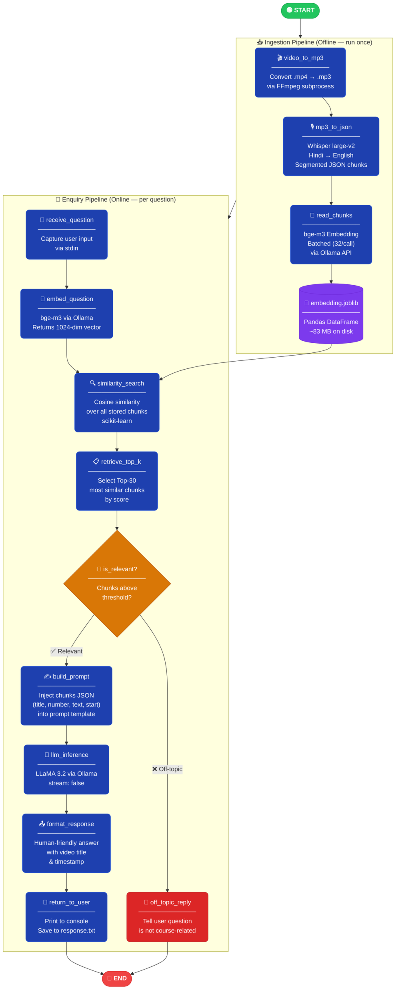
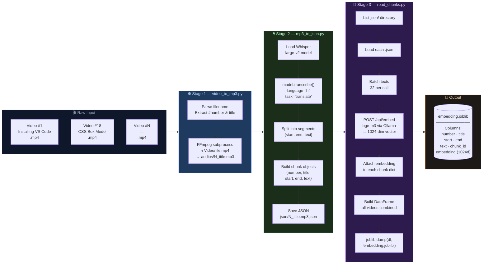
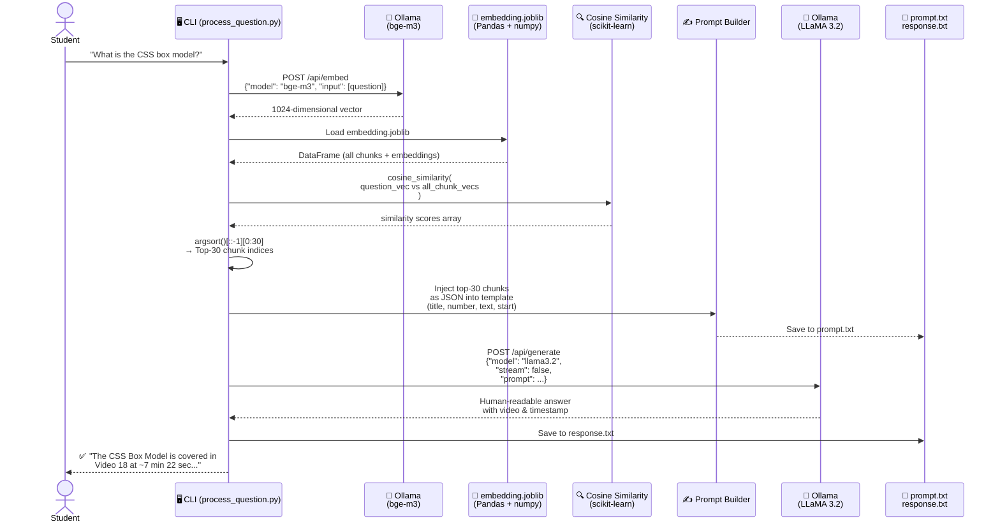
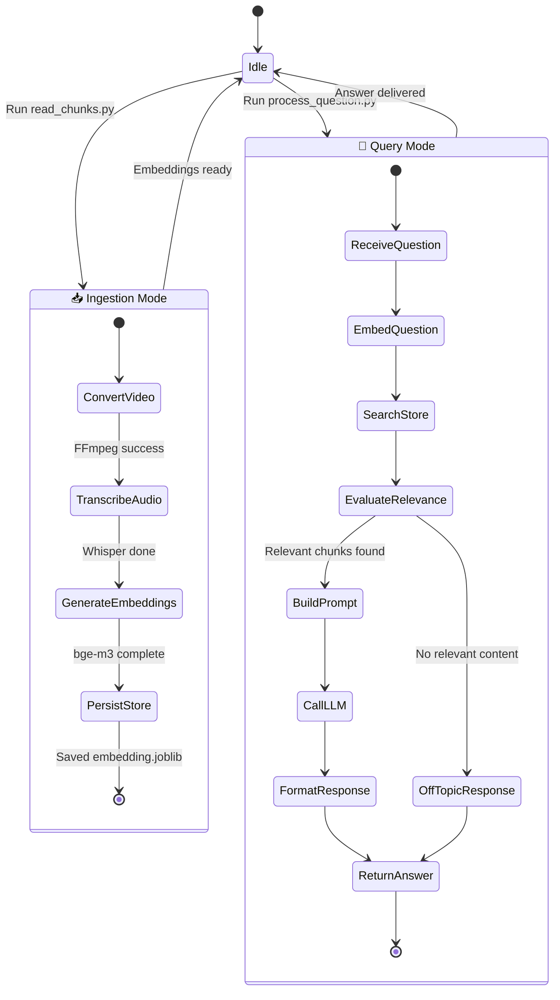
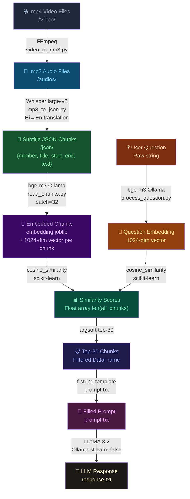

# 🧠 Course RAG Assistant — Architecture & Pipeline Diagrams

> Visual workflow documentation for the **Course RAG Assistant** project.  
> Powered by: `bge-m3` · `LLaMA 3.2` · `Whisper large-v2` · `Ollama` · `scikit-learn`

---

## 1. 🗺️ LangGraph Architecture Overview

> This diagram shows how the system would be modeled as a **LangGraph state machine** — each node is a discrete processing step, and edges represent conditional or sequential transitions.

---

## 2. 📥 External Ingestion Pipeline (Detailed)

> Step-by-step flow of how raw course videos become a searchable embedding database.

---

## 3. 💬 Enquiry Pipeline — Query Graph (Detailed)

> What happens when a student asks a question, end-to-end.

---

## 4. 🔄 Full System State Machine (LangGraph Nodes & Edges)

---

## 5. 📊 Data Flow & Transformation Summary

